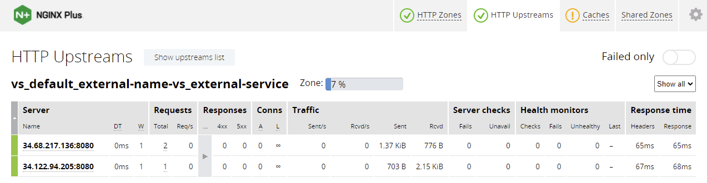
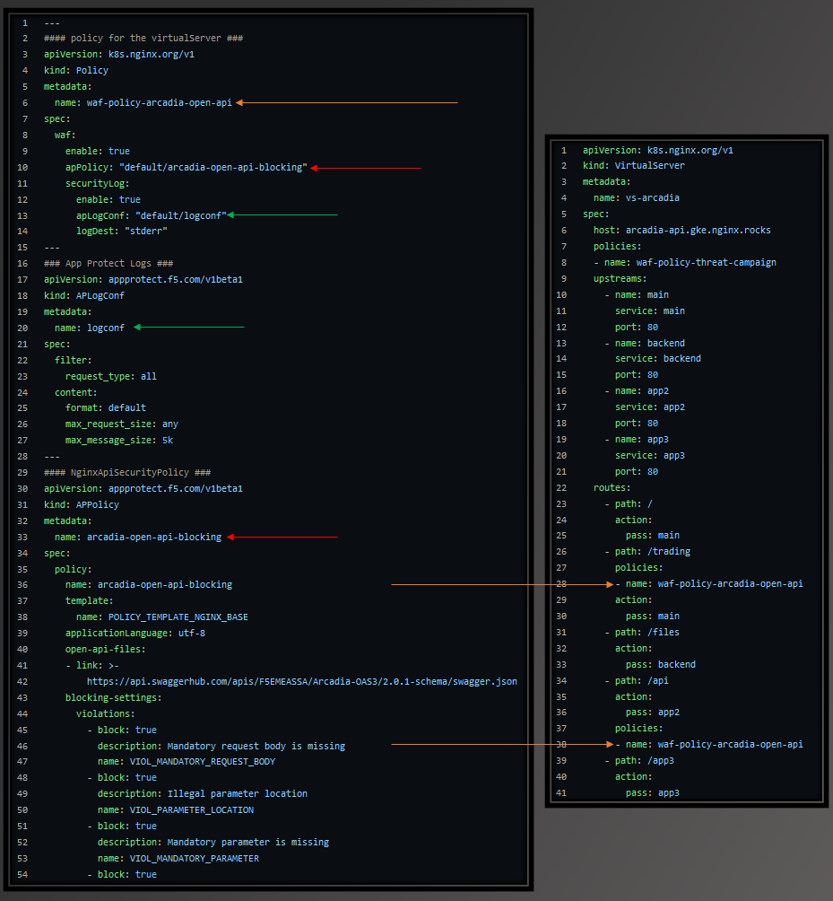
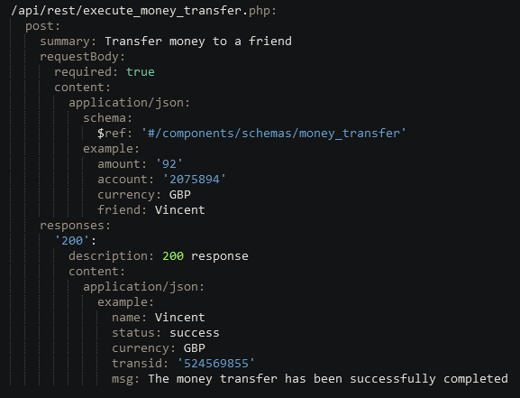

# kic-example-apps

Consolidated some examples from and added a simple app for responses.

<https://docs.nginx.com/nginx-ingress-controller/configuration/configuration-examples/>

Please feel free to add to this repo.

## Usage

The yaml files in the root of this repo can be use individually, the entire application/service and ingress definition is included in each file.

## Helm

The provided helm values are what I use for testing these sample apps.

You will need to add the NGINX Helm repository to use it:

```
helm repo add nginx-stable https://helm.nginx.com/stable
helm repo update
helm install nic-plus nginx-stable/nginx-ingress --namespace nic-plus --create-namespace -f helm/values-plus.yaml
```

Complete documentation is here: [https://docs.nginx.com/nginx-ingress-controller/installation/installation-with-helm/]

## ExternalName Service

A relatively unknown type of service. Per the docs: "An ExternalName Service is a special case of Service that does not have selectors and uses DNS names instead"

The ExternalName example requires that you configure a DNS resolver for the ingress controller. Any DNS server that can resolve the record works, but preferably use the authoritative server for your zone to avoid potentially outdated cached records.

NGINX Plus will resolve all of the IP addresses behind the A record in your service and load balance them using your configured algorithym. You can see the upstream members via the NGINX Plus API or in the dashboard: 


The helm values in this repo contain an example of how to configure a resolver in the nginx configMap.

Note that if your target application is expecting a certain host header, you can set it in the virtrualServer definition and you can see in this example it is configured as `www.nginx.com`.

If you do not configure a resolver, you see this message:

```
kubectl describe virtualservers.k8s.nginx.org external-name-vs 
...
NAME               STATE     HOST
external-name-vs   Warning   externalname.gke.nginx.rocks
...
  message: 'Configuration for default/external-name-vs was added or updated ; with
    warning(s): Type ExternalName service external-service in upstream external-service
    will be ignored. To use ExternaName services, a resolver must be configured in
    the ConfigMap'
  reason: AddedOrUpdatedWithWarning
  state: Warning
```

## NGINX App Protect

There is a sub-directory in this repo that contains a complete application and ingress definitions that protects it utilizing the NGINX App Protect WAF.

The sample application is "Arcadia Financial" which is a micro-service based deployment. The App Protect example contains two different policies:

1. An API Security policy that uses an open API spec that defines exactly what URI, method and request body should contain
1. A "Threat Campaign" policy that uses the F5 Labs high-accuracy (low false positive) patterns. This policy, by default, also enables the default policy which blocks all OWASP top 10 attack patterns.

The base path / is protected by the OWASP top 10 + threat campaign policy and the /trading and /api endpoints are protected by the very specific policy that is created by linking to the Arcadia OpenAPI spec file <https://app.swaggerhub.com/apis/F5EMEASSA/Arcadia-OAS3/2.0.1-schema>

There are several mappings that are required in order enable App Protect. The diagram belows is color coded to show the various mappings.



## Deployment

1. Update the hostnames in the virtualserver definition and provided tests (find/replace/sed)
1. You can deploy all files at once:

    ```shell
    kubectl apply -f .
    ```

1. Make sure everything works by running

    ```shell
    kubectl get vs vs-arcadia
    ```

    *Note the STATE should be "Valid"*

## Testing Protection/Exploits

There are several requests / attacks provided in the tests folder. Note that the OpenAPI spec defines the method for each API call. In the case of buy stocks, it is a POST.


1. When you run the curl command from the [test/01-post-money-transfer.sh](test/01-post-money-transfer.sh) which uses the POST method, the request completes successfully.

1. When you run the [app-protect-openapi-arcadia/test/01-post-money-transfer.sh](app-protect-openapi-arcadia/test/01-post-money-transfer.sh) which uses the GET method, the request is blocked.

1. The directory [app-protect-openapi-arcadia/tests](app-protect-openapi-arcadia/tests) contains some common exploits.
